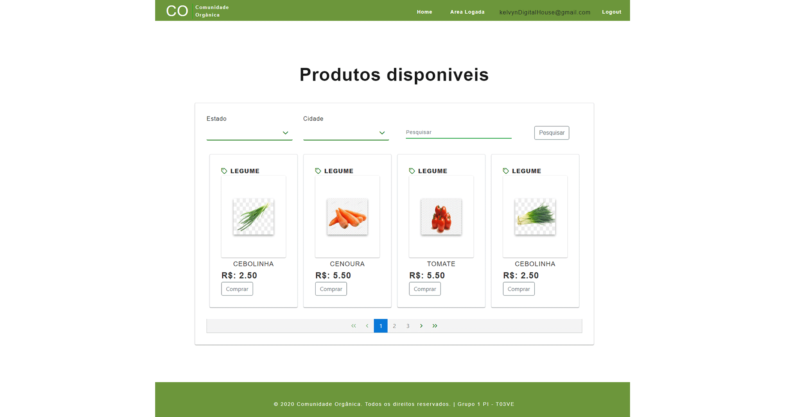

# Projeto Integrado 
## Santander coders java - Digital House

## **Comunidade Orgânica**

Este projeto foi gerado com [Angular CLI](https://github.com/angular/angular-cli) version 10.0.5.

## Development server

Execute `ng serve` para um servidor de desenvolvimento. Navegue até `http: // localhost: 4200 /`. O aplicativo será recarregado automaticamente se você alterar qualquer um dos arquivos de origem.

 

Tecnologias usadas

Back end | Front end 
------------ | -------------
Spring boot | Angular CLI version 10.0.5. 
Banco de dados MySql | Bootsrap 4 
Lombok | PrimeNG 
Hibernate |
Aws service |
Swagger |
OAthu2 |
Spring security jwt |
Spring boot starter mail |

**Link dá aplicação na nuvem**
https://comunidadeorganica.herokuapp.com
 

###### gif de alguns prits de tela do sistema.

